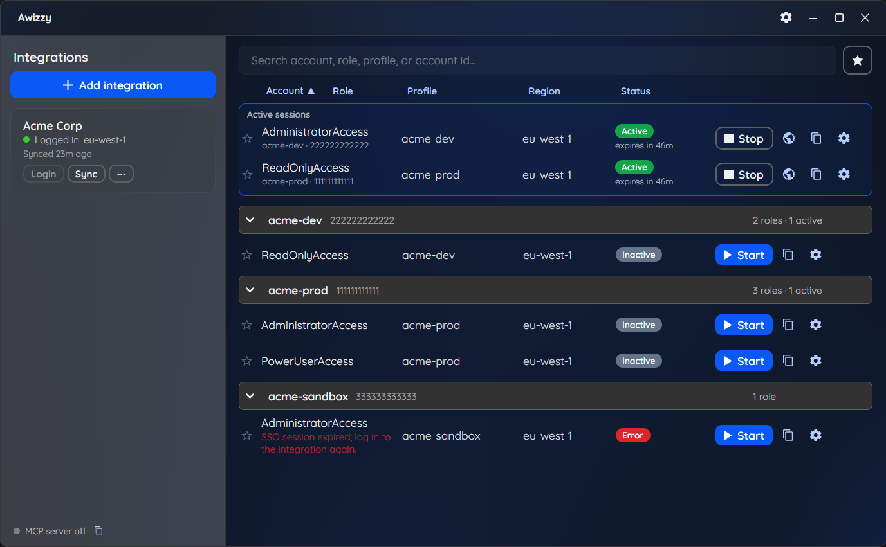

# Awizzy

A desktop AWS SSO credential manager. Sign into IAM Identity Center once, then start and
stop role sessions that write short-lived credentials to your local AWS profile. Includes a
local MCP server so AI tools (Claude Code, Codex, Cursor, ...) can manage sessions too.

<p align="center">
  
</p>

## Platforms

- **Windows** (x64) - secrets protected with DPAPI.
- **macOS** (Apple Silicon) - secrets protected with an AES-256 key held in the login
  Keychain. Builds are currently unsigned: on first launch, right-click the app and
  choose Open (or run `xattr -dr com.apple.quarantine "/Applications/Awizzy.app"`).
  macOS may also show a one-time local-network prompt when the MCP server is enabled.

Install from the [latest release](https://github.com/Hawxy/Awizzy/releases/latest);
the app updates itself from GitHub releases.

## Building

```
dotnet build Awizzy.slnx
dotnet run --project tests/Awizzy.Core.Tests
dotnet run --project src/Awizzy.App -- --demo
```

`--demo` runs against a throwaway sample workspace instead of your real data.
